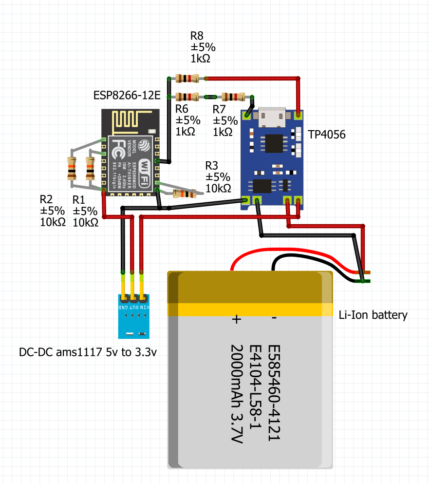
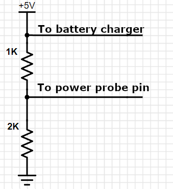
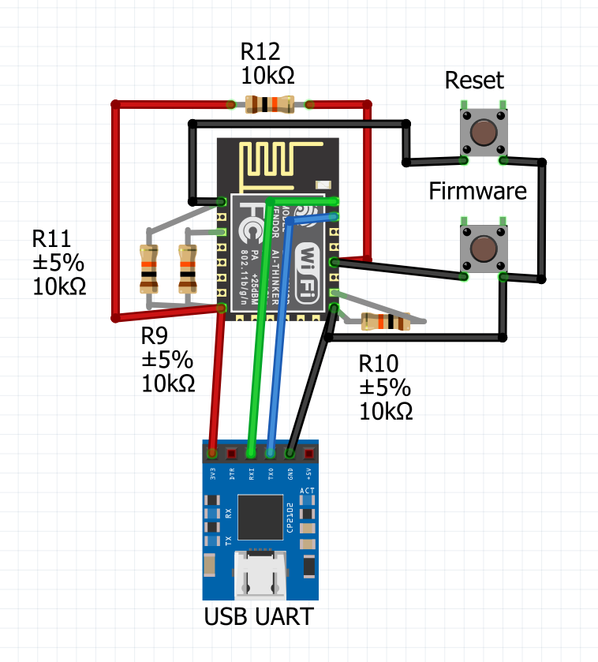

### ESP8266 Telegram Power Info

This project sends messages to a Telegram chat when the power goes out or comes back on.

## Description and Infrastructure Requirements

The project is based on the ESP8266 board. WiFi connectivity is required at the time of the status changes to be able to send messages, so some kind of UPS is required for your WiFi router. The ESP8266 also requires backup power to send the message. There are two ways to achieve this:

### Approach 1. Using a Li-Ion Battery for the ESP8266

This can be done using a regular 3.7V Li-Ion battery and a charging board (e.g., TC4056). Please see this [video](https://www.youtube.com/watch?v=Lk__xTxLlY0) for details. To reduce the supply voltage to 3.3V, a voltage regulator like the MCP1700-3302E can be used, as detailed in this [video](https://www.youtube.com/watch?v=Z-36HflHotU). To power the ESP8266, two MCP1700-3302E regulators can be used in parallel. Alternatively, a DC-DC module based on the AMS1117 can be used, but it may provide less than 3V, causing the ESP8266 to work unstably.

Be cautious when working with batteries, as short circuits can be dangerous. A single 5V power adapter can be used both to charge the ESP8266 battery and to detect power outages.

### Materials Required:
- ESP8266 board
- TC4056/TP4056/TP4057 charging module with protection (ensure the module has protection)
- Two MCP1700-3302E voltage regulators or a DC-DC module based on AMS1117
- Two resistors: R1 = 1K, R2 = 2K (or other values with the same ratio; e.g., two 1K resistors in series)
- Electrolytic capacitor (~1000µF, mind the polarity) if using MCP1700-3302E
- Ceramic capacitor (~100nF, any type) if using MCP1700-3302E
- Phone USB charger and MicroUSB/Type-C cable

### Approach 2. Using Two Power Supplies with ESP8266 with USB Input

You can use two 5V power supplies: one connected directly to detect power loss, and another connected to a UPS to power the ESP8266. Ensure that the grounds of both supplies are connected.

Backup power is required only for sending messages (even 1 minute is sufficient) and is not required for the entire duration of the power outage.

A voltage divider circuit (two resistors, where 2*R1 = R2) is used to reduce the power probe voltage to 3.3V. Please do not apply 5V directly to an input pin.

### ESP8266 Without USB

#### Required Connections for ESP8266 Without USB:

1. Connect GND and GPIO15 using a 10kΩ resistor
2. Connect VCC and CH_PD using a 10kΩ resistor
3. Connect VCC and REST using a 10kΩ resistor

#### Before Firmware Upload to ESP8266:

1. Connect VCC and GPIO0 using a 10kΩ resistor
2. Connect GND and GPIO0 using a button (firmware button)
3. Connect VCC and REST using a button (reset button)
4. Connect VCC and 3.3V output from the USB UART converter
5. Connect GND to the GND output from the USB UART converter
6. Connect TXD (GPIO1) to RXD output from the USB UART converter
7. Connect RXD (GPIO3) to TXD output from the USB UART converter

#### Firmware Upload Procedure:

1. Connect the USB UART converter to the computer
2. Press and hold the Reset button
3. Press and hold the Firmware button
4. Release the Reset button
5. Release the Firmware button
6. Upload the firmware using VSCode:
6.1. Open platformio.ini and check com port number
6.2. Open PlatformIO from the left sidebar. Install PlatformIO if needed. Restart VSCode after installation
6.3. Select "Upload" or "Upload and Monitor" to upload firmware.

### Telegram Settings

You need to create a bot in Telegram that will send the messages using @BotFather. Add the bot to the chat.

### Bot Settings

Configure all settings in the `Constants.h` file. Here, you can set up WiFi credentials, the Telegram bot key, and other settings.

### Service Messages

- `/start` - Provides information about the bot and available commands
- `/showstatus` - Shows the current power status

#### Admin Commands (Admin chat_id is configured in the `Constants.h` file):

- `/showalldata` - Displays all saved data
- `/clearallsubscribers` - Deletes all subscribers
- `/addsubscriber {chat_id} {user_name}` - Add a new subscriber;
- `/removesubscriber {chat_id}` - Deletes an individual subscriber
- `/replacesubscribers {Data_Content}` - Replaces the entire data file
- `/setthread {chat_id} {thread_id}` - Sets the thread_id for the group if the group is divided into topics, allowing the bot to write to a specific topic (thread)

### ESP32

This project is also available for ESP32 [here](https://github.com/anha1/telegram-power-info).
